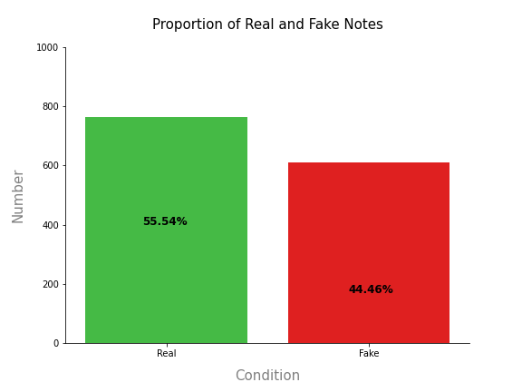
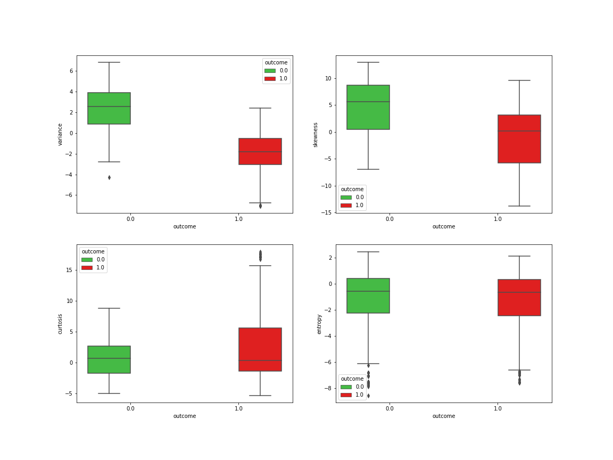
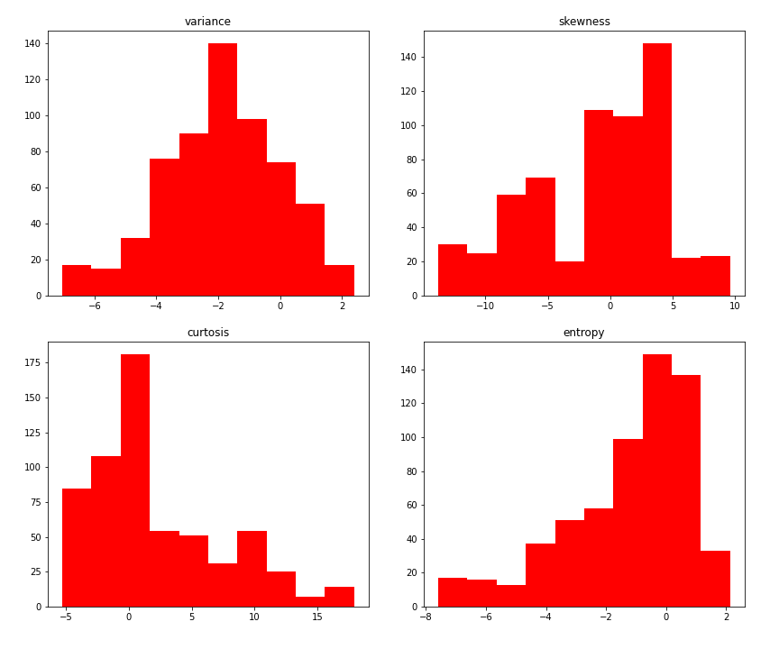
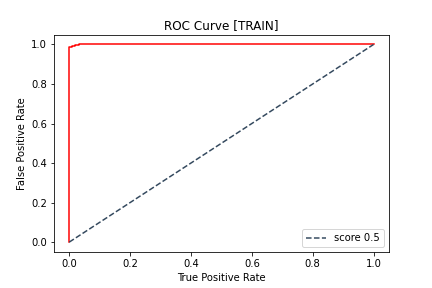
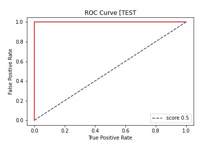
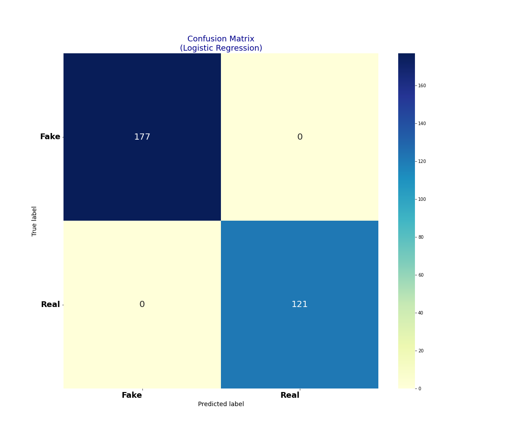

# 💵 Bank Note Authentication: Project Overview
* End to end project classifying real and fake bank notes.
* Apache Spark Python API used for speed benefits. 

## Table of Contents 
[Resources](#resources)<br>
[Data Collection](#DataCollection)<br>
[Data Pre-processing](#DataPre-processing)<br>
[Data Warehousing](#DataWarehousing)<br>
[Exploratory data analysis](#EDA)<br>
[Feature Engineering](#FeatEng)<br>
[ML/DL Model Building](#ModelBuild)<br>
[Model performance](#ModelPerf)<br>
[Model Evaluation](#ModelEval)<br>
[Project Management (Agile | Scrum)](#Prjmanage)<br>
[Project Evaluation](#PrjEval)<br>
[Looking Ahead](#Lookahead)<br>
[Questions | Contact me ](#Lookahead)<br>

<a name="Resources"></a>  

## Resources Used
**PySpark, Python 3, PostgreSQL** 

[**Anaconda Packages:**](requirements.txt) **pandas numpy sklearn matplotlib seaborn sqlalchemy kaggle psycopg2 ipykernel pyspark** <br><br>
Powershell command for installing anaconda packages used for this project  
```powershell
pip install pandas numpy sklearn matplotlib seaborn sqlalchemy kaggle psycopg2 ipykernel pyspark 
```
<br><br>
Initiating spark session 
```python
# Creating spark session 
spark = SparkSession.builder.appName('P10').getOrCreate()
```

<a name="DataCollection"></a>  

## [Data Collection](Code/P10_Code.ipynb)
Powershell command for data import using kaggle API <br>
```powershell
!kaggle datasets download -d ritesaluja/bank-note-authentication-uci-data -p ..\Data --unzip 
```
[Data source link](https://www.kaggle.com/ritesaluja/bank-note-authentication-uci-data)
[Data](Data/BankNote_Authentication.csv)
*  Rows: 1372 | Columns: 5
    *   variance                   
    *   skewness                      
    *   curtosis                 
    *   entropy                 
    *   class                      
                    

<a name="DataPre-processing"></a>  

## [Data Pre-processing](Code/P10_Code.ipynb)
After I had all the data I needed, I needed to check it was ready for exploration and later modelling. I made the following changes and created the following variables:   
*   General NULL and data validity checks  
*   The datatypes needed fixing as well as renaming a column because of the use of the name 'class' in python 
```python
# Correcting data types 
data = data.selectExpr("cast(variance as double) variance",
    "cast(skewness as double) skewness",
    "cast(curtosis as double) curtosis",
    "cast(entropy as double) entropy",
    "cast(class as double) class")

# Renaming class column 
data = data.withColumnRenamed("class","outcome")
```

<a name="DataWarehousing"></a>

## [Data Warehousing](Code/P7_Code.ipynb)
I warehouse all data in a Postgre database for later use and reference.

*   ETL in python to PostgreSQL Database.
*   Formatted column headers to SQL compatibility.  

<a name="EDA"></a>  

## [Exploratory data analysis](Code/P7_Code.ipynb) 
I looked at the distributions of the data and the value counts for the various categorical variables that would be fed into the model. Below are a few highlights from the analysis.
*   55.54% of the bank notes in the data are real notes.



*   Boxplots were used to visualise features with outliers. These features were not scaled as this was POC project. I know that LogisticRegression models are very sensitive to the range of the data points so scaling is advised. 


*   I visualised the distribution of features for the fake bank notes 


*   The correlation matrix shows those features with strong and particularly weak correlations 


<a name="FeatEng"></a>  

## [Feature Engineering](Code/P7_Code.ipynb) 
There was no need to transform the categorical variable(s) into dummy variables as they are all numeric. I also split the data into train and tests sets with a test size of 20%.
*   I had to random Split instead of using train_test_split from sklearn 
```python
# Splitting data into train and test data
train_data,test_data=model_data.randomSplit([0.80,0.20], seed=23)

```
<!-- *   One Hot encoding to encode values -->
  

<a name="ModelBuild"></a> 

## [ML/DL Model Building](Code/P7_Code.ipynb)

I used the LogisticRegression model and evaluated them using initially using accuracy_score and a confusions matrix. 
*   I fed the independent and dependent features to the model and training it on the training data 
```python
# Calling LinearRegression algorithm and applying features and outcome 
regressor=LogisticRegression(featuresCol='features', labelCol='outcome')

# Training model on training data 
model=regressor.fit(train_data)
```

<a name="ModelPerf"></a> 

## [Model performance](Code/P7_Code.ipynb)
The Logistic Regression model performed well on the train and test sets. 
*   **Logistic Regression** : Accuracy = 100% 

<!-- 
<a name="ModelOpt"></a> 

## [Model Optimisation](Code/P7_Code.ipynb)
In this step, I used GridsearchCV and RandomizedSearchCV to find the best parameters to optimise the performance of the model.
Using the best parameters, I improved the SVC model accuracy of SVC by **1.3%**. The Logistic Regression model however saw no increase in accuracy. 

*   **Logistic Regression** : Accuracy = 77.92% | MSE = 0.22 | RMSE =  0.47 (2dp)
*   **SVC** : Accuracy = 77.27%  | MSE = 0.23 | RMSE =  0.48 (2dp)   -->

<a name="ModelEval"></a> 

## [Model Evaluation](Code/P7_Code.ipynb)
* The ROC Curve shows the accuracy show reflect of both the train and test datasets 



*   A confusion matrix showing the accuracy score of True and False predictions achieved by the model. 
*   The model performed perfectly with no FP or FN (False Positive or False Negatives)



<!-- 
<a name="ModelProd"></a> 

## [Model Productionisation](Code/P7_Code.ipynb)
*   I used the pickle library to export the model. 
```python
# Dump model into pickle file
pickle.dump(model1, open('.././svc_diabetes.pkl', 'wb'))
```  

<a name="ModelDeploy"></a> 

## [Deployment](app.py)
I built a flask REST API endpoint that was hosted on a local webserver before Heroku deployment. The API endpoint takes in request values and returns prediction of diabetes diagnosis. I also optimised and formatted the frontend using HTML and CSS.  -->

<a name="Prjmanage"></a> 

## [Project Management (Agile | Scrum)](https://www.atlassian.com/software/jira)
* Resources used
    * Jira
    * Confluence
    * Trello 

<a name="PrjEval"></a> 

## [Project Evaluation](Presentation/P11Presentation.pptx) 
*   WWW
    *   The end-to-end process
    *   Use of Spark and Databricks
*   EBI 
    *   Look at productionising use MLlib
    

<a name="Lookahead"></a> 

## Looking Ahead
*   What next
*   More Pyspark??? 

<a name="Questions"></a> 

## Questions | Contact me 
For questions, feedback, and contribution requests contact me
* ### [Click here to email me](mailto:theanalyticsolutions@gmail.com) 
* ### [See more projects here](https://github.com/MattithyahuData?tab=repositories)


